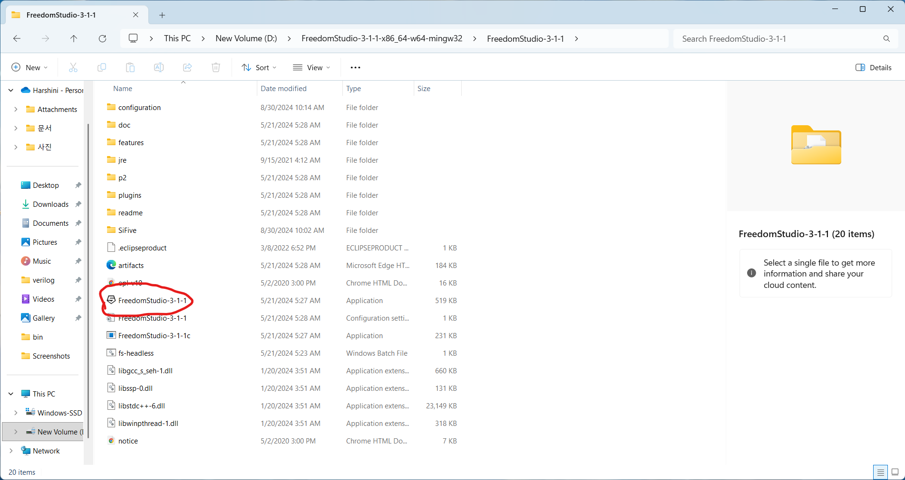
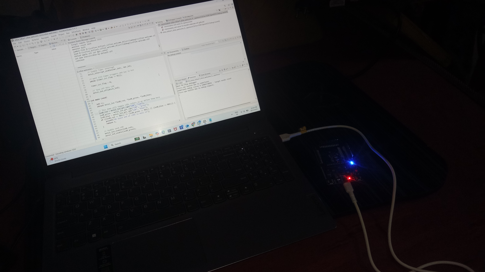

---


# VSDSquadron PRO RISC-V Board Validation

This repository documents the setup, toolchain installation, and validation of the VSDSquadron PRO RISC-V development board using the `sifive-welcome` test program. The board is powered by the SiFive FE310-G002 SoC, designed for IoT and edge computing applications.

---

## 🗂 Repository Structure

```
VSDSquadronPro/
└── task 1/
    ├── README.md
    └── images/
        ├── 1 step usb.png
        ├── 2 step usb.png
        ├── 3 step usb.png
        ├── freedomstudio 3-1-1.png
        ├── application.png
        ├── step 1.png
        ├── step 2.png
        ├── step 3.png
        ├── step 4.png
        └── output.jpg
```

---

## 🛠 Hardware and Software Setup

### 1. Board Specifications

- **Core**: 32-bit RV32IMAC SiFive E31 CPU, up to 320 MHz  
- **Memory**:
  - 16 KB L1 Instruction Cache  
  - 16 KB Data SRAM scratchpad  
  - 32 Mbit (4 MB) ISSI SPI/QSPI Flash  
- **Peripherals**:
  - 19 digital I/O pins, 9 PWM pins  
  - 2 UARTs, 1 I2C, 1 SPI  
  - USB-C for power, programming, and debug  
- **Other**:
  - 16 MHz on-board crystal  
  - 3.3V I/O, 5V input  
  - RISC-V Debug Spec 0.13 compliant  
- **Form Factor**: 84 x 52 mm, optimized for room temperature (20–35°C)

Refer to the VSDSquadron PRO User Guide for detailed specs (Table 3) and IO assignments (Table 2).

---

### 2. Toolchain and Software Installation (Windows)

#### ✅ Driver Installation

Used Zadig to install `libusb-win32` for Dual RS-232-HS (Interface 0)  
  
  


#### 🧰 Freedom Studio Setup

Downloaded `VSDSquadronPRO.tar.gz` from the VSD website  
Extracted to `D:\FreedomStudio`  
Launched `FreedomStudio-3-1-1.exe`, clicked "Run anyway" on Windows security prompt  
Created a new workspace  
  


#### 📦 Dependencies

Freedom Studio includes:
- RISC-V GNU toolchain (`riscv32-unknown-elf-gcc`)  
- OpenOCD  
- SiFive Freedom E SDK  

These are sufficient for FE310-G002 development.

---

## 🚀 Running the sifive-welcome Program

### Steps in Freedom Studio:

1. Created a new project using the `sifive-hifive1` SDK (compatible with FE310-G002)  
2. Selected the `sifive-welcome` example  
3. Generated a debug configuration  
4. Connected the board via USB-C (5V input)  
5. Opened **Debug Configurations > OpenOCD tab > Debug**  
     
     
     
   

### Execution:

Clicked **Resume/Run** in the debug perspective  
Observed `"SiFive"` output in the console terminal (UART0 on IO16/17)  
Verified blue LED blink on GPIO 19  


### Notes:

- Encountered one debug session conflict; resolved by terminating the active session  
- Successfully validated:
  - USB programming  
  - UART output  
  - GPIO functionality  

---

## ✅ Findings and Validation

- **Toolchain**: Freedom Studio worked seamlessly for compiling and uploading  
- **Board Functionality**:
  - UART0 (IO16 RX, IO17 TX) for console output  
  - GPIO 19 for LED control  
  - JTAG debugging via USB-C and OpenOCD  
- **Issues**: Zadig required correct interface selection during driver install  

---


